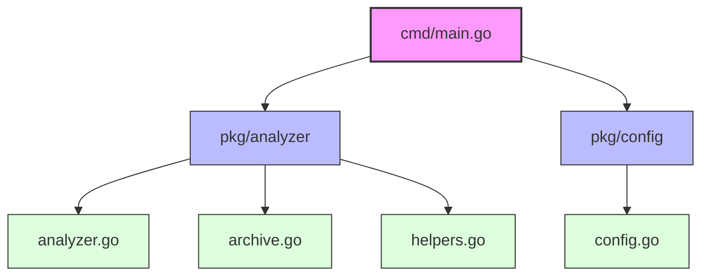

# GitHub Repository Pulse Check

[](https://golang.org/)
[](LICENSE)

A powerful CLI tool to analyze GitHub repositories for inactivity and contributor engagement. Identify stale repositories and understand contributor participation patterns in your GitHub organizations.

## 🔍 Features

- **Organization Analysis**: Scan all repositories within a GitHub organization
- **Single Repository Analysis**: Analyze specific repositories
- **Batch Analysis**: Process multiple repositories from a list
- **Multiple Output Formats**: Console, JSON, and CSV outputs
- **Customizable Thresholds**: Configure what constitutes "inactive" repositories and contributors
- **Comprehensive Metrics**: Track last commit dates, contributor activity, and archive status

## 📊 Project Structure



## 🚀 Installation

### Prerequisites

- Go 1.24.2 or higher
- GitHub CLI (`gh`) installed and authenticated

### Building from Source

```bash
# Clone the repository
git clone https://github.com/harekrishnarai/inactivity.git
cd inactivity

# Build the executable
go build -o inactivity ./cmd/main.go
```

## 📝 Usage

```bash
# Analyze an organization
inactivity org --org <organization-name> [options]

# Analyze a single repository
inactivity repo <org/repo-name> [options]

# Analyze multiple repositories from a file
inactivity list --file <path-to-repo-list> [options]
```

### Options

- `--days <number>`: Maximum age of last commit in days (default: 180)
- `--threshold <float>`: Threshold of inactive contributors (0.0-1.0) (default: 0.5)
- `--format <format>`: Output format: console, json, or csv (default: console)
- `--output <file>`: Output file path (optional)
- `--silent`: Suppress banner and progress output

## 📄 Output Example

### Console Output
```
Repository: example-repo
  Last Commit: 2025-01-15 (135 days ago)
  Contributors: 12 total, 7 inactive (58.3%)
  Status: ⚠️ Flagged as inactive
```

### JSON/CSV Outputs
Export detailed repository analytics for further processing or integration with other tools.

## 🤝 Contributing

Contributions are welcome! Please feel free to submit a Pull Request.

1. Fork the repository
2. Create your feature branch (`git checkout -b feature/amazing-feature`)
3. Commit your changes (`git commit -m 'Add some amazing feature'`)
4. Push to the branch (`git push origin feature/amazing-feature`)
5. Open a Pull Request

## 📜 License

This project is licensed under the MIT License - see the LICENSE file for details.

## 🙏 Acknowledgements

- [GitHub CLI](https://cli.github.com/) for providing the API interface
- [Fatih Color](https://github.com/fatih/color) for colorful terminal output
- [Progressbar](https://github.com/schollz/progressbar) for elegant progress indicators
